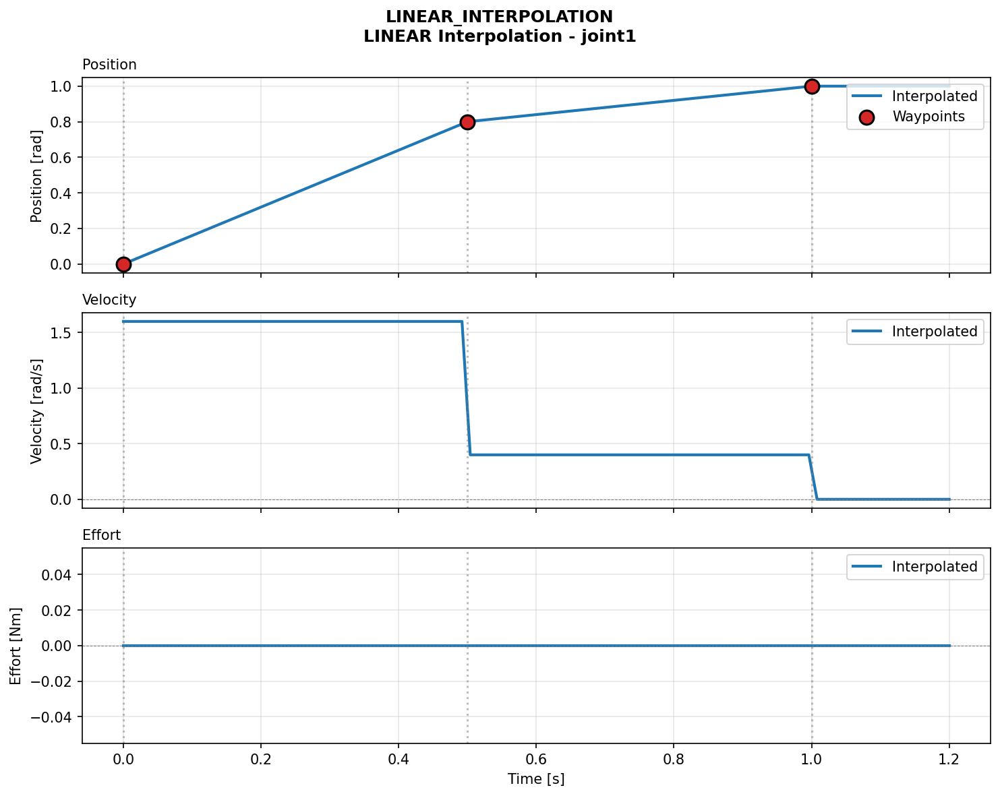
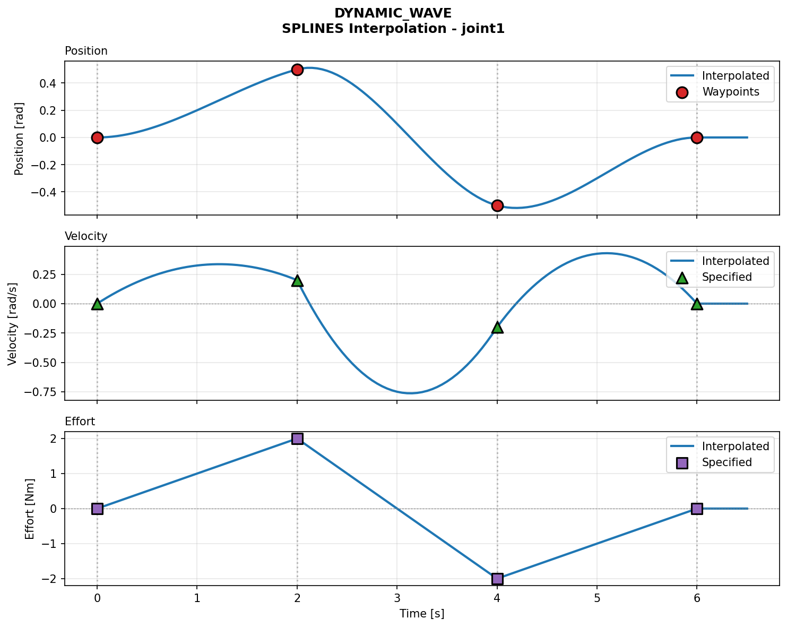

## Introduction


This project is based on the [joint_trajectory_controller](https://github.com/ros-controls/ros2_controllers/tree/humble/joint_trajectory_controller). It provides a `ros2_control` `ControllerInterface` used as a simplified `joint_forward_trajectory_controller` for trajectory interpolation. It is designed as a controller for executing joint-space trajectories on a group of joints.


The controller accepts trajectory goals and interpolates them using selected methods to provide smooth commands to the hardware.


Command interfaces provided by the hardware interface can include `position`, `velocity` and `effort`. Controller requires them to be in the following combinations:

- `position`

- `position`, `velocity`

- `position`, `effort`

- `position`, `velocity`, `effort`


### Software supports:

- Action server execution via `control_msgs/action/FollowJointTrajectory`

- Working independently via topic subscriber using `trajectory_msgs/msg/JointTrajectory`

- Querying state via `control_msgs/srv/QueryTrajectoryState` (**Note:** currently it returns only `position` and `velocity`)


## Interpolation methods


The controller supports configuring the interpolation method via the `interpolation_method` parameter. The allowed methods are `splines` and `none`.


### 1. `none`

No interpolation is applied between trajectory points. The controller executes points strictly as they are received.


### 2. `splines`

Polynomial splines are used to compute smooth intermediate state based on boundary conditions given by the trajectory points. Depending on the provided fields in the trajectory msg, a different interpolation order is applied:


**Linear Interpolation**

Used when only positions are provided in the trajectory message. It computes intermediate positions linearly and provides a constant velocity:

$\boldsymbol{p}(t) = \boldsymbol{a}_0 + \boldsymbol{a}_1 t$

$\boldsymbol{v}(t) = \boldsymbol{a}_1$




**Cubic Spline Interpolation**

Used specifically when *both positions and velocities* are provided in the trajectory message. A third-degree polynomial ensures smooth position and continuous velocity between trajectory waypoints:

$\boldsymbol{p}(t) = \boldsymbol{a}_0 + \boldsymbol{a}_1 t + \boldsymbol{a}_2 t^2 + \boldsymbol{a}_3 t^3$

$\boldsymbol{v}(t) = \boldsymbol{a}_1 + 2 \boldsymbol{a}_2 t + 3 \boldsymbol{a}_3 t^2$




*Where:*

- $\boldsymbol{p}(t)$ and $\boldsymbol{v}(t)$ are position and velocity at time $t$.

- $\boldsymbol{a}_n$ are the polynomial coefficients derived from the start and end points of the trajectory segment.


## ROS 2 version

- Humble (supports `ros2_control` for Rolling)


## Dependencies (all for humble)

- [ros2_control](https://github.com/ros-controls/ros2_control)

- [control_msgs](https://github.com/ros-controls/control_msgs)

- [realtime_tools](https://github.com/ros-controls/realtime_tools)

- [generate_parameter_library](https://github.com/PickNikRobotics/generate_parameter_library)

- [trajectory_msgs](https://github.com/ros2/common_interfaces)


## Installation

1. Clone repo to your workspace:

```bash

git clone https://github.com/KNR-PW/LRT_forward_trajectory_controller.git

```

2. Install dependencies in workspace:

```bash

rosdep install --ignore-src --from-paths . -y -r

```

3. Build

```bash

colcon build --packages-select joint_forward_trajectory_controller

```


## Controller parameters (example):


```yaml
...
joint_forward_trajectory_controller:
   type:
     joint_forward_trajectory_controller/JointForwardTrajectoryController
...
joint_forward_trajectory_controller:
    ros__parameters:
        joints:
            - joint_1
            - joint_2

        command_interfaces:
            - position
            - velocity
            - effort

        allow_partial_joints_goal: false
        allow_integration_in_goal_trajectories: false
        action_monitor_rate: 20.0
        interpolation_method: "splines"
        allow_nonzero_velocity_at_trajectory_end: true
        cmd_timeout: 0.0    
...
```

#### `joints` - joint names to control and listen to.


#### `command_interfaces` - command interfaces provided by the hardware interface for all joints. Supported combinations are:

- `["position"]`

- `["position","velocity"]`

- `["position","effort"]`

- `["position","velocity","effort"]`


#### `allow_partial_joints_goal` - allow joint goals defining trajectory for only some joints.


#### `allow_integration_in_goal_trajectories` - allow integration in goal trajectories to accept goals without position or velocity specified.


#### `action_monitor_rate` - rate to monitor status changes when controller is executing an action (control_msgs::action::FollowJointTrajectory).


#### `interpolation_method` - the type of interpolation to use. Allowed values are `"splines"` or `"none"`.


#### `allow_nonzero_velocity_at_trajectory_end` - if false, the last velocity point has to be zero or the goal will be rejected.


#### `cmd_timeout` - timeout after which the input command is considered stale. Timeout is counted from the end of the trajectory. If `0` , timeout is deactivated.

## Trajectory Visualization (Debug Scripts)

To help you understand and verify how the controller interpolates trajectories you can use the visualization tools provided in the `debugScripts` directory.

### How to generate logs and run `trajectoryVisualizer.py`:

1. Make sure you have the necessary Python plotting libraries installed.
2. Build package and run the `test_forward_trajectory` test using `colcon`. This will automatically generate log files containing the trajectory data:

```bash
colcon test --packages-select joint_forward_trajectory_controller --ctest-args -R "test_forward_trajectory"
```
3. Run the visualizer script using the generated log file (typically located in the `log` directory).

**Usage examples:**
```bash
    python3 debugScripts/trajectoryVisualizer.py -save ../../log/latest_test/joint_forward_trajectory_controller/stdout.log
```
